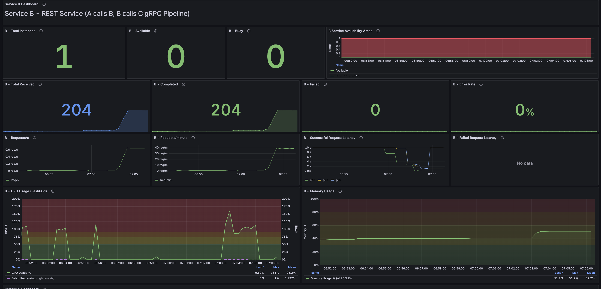

# CPU Spike Simulation in FastAPI Service B

## Overview
本文檔說明如何在 FastAPI Service B 中實現 CPU 使用率尖峰模擬，用於測試和觀察系統在高負載情況下的表現。

## 核心實現原理

### 1. CPU 密集型運算設計
```python
def cpu_intensive_batch_process(data_size: int, intensity: float = 1.0):
    """
    模擬 CPU 密集型批次資料處理
    - data_size: 處理的記錄數量
    - intensity: CPU 強度倍數 (1.0 = 正常, 2.0 = 雙倍強度)
    """
```

#### 關鍵技術點：

**a. 記憶體分配模擬**
```python
# 模擬載入大量資料到記憶體
batch_data = []
for i in range(min(data_size, 100000)):  # 限制最多 100k 筆避免記憶體耗盡
    record = np.random.random(int(100 * intensity))  # 根據強度調整陣列大小
    batch_data.append(record)
```
- 使用 NumPy 創建隨機數陣列模擬實際資料記錄
- 陣列大小隨 intensity 參數調整，影響記憶體使用量

**b. CPU 密集運算**
```python
# CPU 密集處理階段
operations = int(1000 * intensity)  # 每筆記錄的運算次數

for record in batch_data:
    for _ in range(operations):
        result = np.sum(record ** 2)      # 平方運算
        result = np.sqrt(result)           # 開根號運算
        result = np.log(result + 1)        # 對數運算
```
- 使用矩陣運算（平方、開根號、對數）消耗 CPU 資源
- 運算次數可透過 intensity 參數調整

### 2. 非阻塞式設計
```python
@app.post("/batch_process")
async def batch_process(size: int = 10000, intensity: float = 1.0):
    # 在執行緒池中執行，避免阻塞事件循環
    loop = asyncio.get_event_loop()
    result = await loop.run_in_executor(
        None,  # 使用預設執行緒池
        cpu_intensive_batch_process,
        size,
        intensity
    )
```
- 使用 `run_in_executor` 在獨立執行緒中執行 CPU 密集運算
- 保持 FastAPI 的非同步特性，不會阻塞其他請求處理

### 3. 系統監控實現

**a. CPU 和記憶體監控**
```python
def monitor_system_metrics():
    while True:
        process = psutil.Process()
        cpu_percent = process.cpu_percent(interval=0.1)
        mem_percent = process.memory_percent()
        
        # 更新 Prometheus 指標
        CPU_USAGE.set(cpu_percent)
        MEM_USAGE.set(mem_percent)
        
        time.sleep(1)  # 每秒更新一次
```
- 使用 psutil 套件取得當前進程的 CPU 和記憶體使用率
- 背景執行緒持續監控並更新 Prometheus 指標

**b. Prometheus 指標定義**
```python
CPU_USAGE = Gauge("b_cpu_usage_percent", "Current CPU usage percentage")
MEM_USAGE = Gauge("b_memory_usage_percent", "Current memory usage percentage")
BATCH_PROCESSING = Gauge("b_batch_processing", "Whether batch processing is active (0/1)")
BATCH_SIZE = Histogram("b_batch_size", "Size of processed batches", 
                       buckets=[100, 500, 1000, 5000, 10000, 50000, 100000, 500000, 1000000])
```

## 使用方式

### 1. 單次觸發 CPU 尖峰
```bash
# 小型批次處理（輕微 CPU 尖峰）
curl -X POST "http://localhost:8080/batch_process?size=100&intensity=0.5"

# 中型批次處理（中等 CPU 尖峰）
curl -X POST "http://localhost:8080/batch_process?size=1000&intensity=1.0"

# 大型批次處理（嚴重 CPU 尖峰）
curl -X POST "http://localhost:8080/batch_process?size=5000&intensity=2.0"
```

### 2. 參數說明
- **size**: 處理的資料筆數
  - 100: 快速處理，CPU 尖峰時間短
  - 1000: 中等處理時間，明顯的 CPU 尖峰
  - 5000+: 長時間處理，持續的高 CPU 使用率

- **intensity**: CPU 強度倍數
  - 0.5: 輕度負載（CPU 使用率約 50-70%）
  - 1.0: 正常負載（CPU 使用率約 80-100%）
  - 2.0: 高強度負載（CPU 使用率可能超過 100%，多核心）

### 3. 測試腳本
使用提供的 `test_cpu_spike.sh` 腳本進行完整測試：

```bash
./test_cpu_spike.sh
```

測試階段：
1. **Phase 1**: 正常請求（無 CPU 尖峰）- 建立基準線
2. **Phase 2**: 小批次處理（輕微 CPU 尖峰）- 觀察小幅上升
3. **Phase 3**: 恢復期 - CPU 回到正常水平
4. **Phase 4**: 大批次並行處理（主要 CPU 尖峰）- 模擬高負載
5. **Phase 5**: 最終恢復 - 確認系統恢復正常

## Grafana 監控

### 可觀察的指標
1. **B - CPU Usage (FastAPI)**
   - 顯示即時 CPU 使用率百分比
   - 紫色條形圖表示批次處理狀態
   - 可觀察到處理期間 CPU 從基準線急升至 100%+

2. **B - Memory Usage**
   - 顯示記憶體使用率百分比
   - 批次處理期間會看到記憶體使用量增加
   - 處理完成後記憶體會逐漸釋放

### 監控畫面範例

*圖：Grafana 面板顯示 CPU 與記憶體尖峰監控結果*

### 預期行為模式
```
CPU 使用率模式：
      100% |     ████
           |    ██  ██
       50% |   ██    ██
           | ███      ███
        0% |██          ██████
           |________________
           正常  批次  恢復  正常
```

## 實際應用場景模擬

此實現模擬了以下真實場景：

1. **批次資料處理**: 如 ETL 作業、報表生成
2. **資料分析運算**: 統計分析、機器學習推論
3. **影像/影片處理**: 轉碼、壓縮、特效處理
4. **密碼學運算**: 加密/解密大量資料
5. **科學計算**: 數值模擬、矩陣運算

## 效能影響與限制

### 限制措施
1. **記憶體保護**: 最多處理 100,000 筆記錄，避免 OOM
2. **非同步處理**: 使用執行緒池，不阻塞主事件循環
3. **可調整強度**: 透過參數控制負載程度

### 注意事項
- 過高的 intensity 或 size 可能導致請求超時
- 多個並行批次處理可能造成系統資源競爭
- 建議在測試環境中調整參數找出合適值

## Memory 尖峰模擬機制

### 記憶體增長策略

除了 CPU 密集運算外，我們的實現同時模擬記憶體使用量的增長：

#### 1. 三階段記憶體消耗
```python
# Phase 1: 大量數據載入
record_size = int(10000 * intensity)  # 每筆記錄 10K+ 元素
for i in range(data_size):
    record = np.random.random(record_size)  # 大型 NumPy 陣列
    batch_data.append(record)
    
    # 模擬快取機制
    if i % 3 == 0:
        memory_cache.append(np.copy(record))  # 額外記憶體副本
```

#### 2. 中間結果累積
```python
# Phase 2: 處理期間保留中間結果
for idx, record in enumerate(batch_data):
    temp_arrays = []
    for op in range(operations):
        # CPU 運算同時創建臨時陣列
        if op % 50 == 0:
            temp_arrays.append(np.random.random(1000))
    
    # 每 2 筆記錄保存一次中間結果
    if idx % 2 == 0:
        intermediate_results.append({
            'temps': temp_arrays,
            'matrix': np.random.random((100, 100))  # 100x100 矩陣
        })
```

#### 3. 大型數據結構維持
```python
# Phase 3: 聚合階段保持高記憶體使用
aggregated_data = {
    'raw_data': batch_data[:100],     # 保留原始數據樣本
    'cache': memory_cache[:50],       # 快取數據
    'matrices': result_matrices,      # 結果矩陣 (500x500 each)
    'buffers': data_buffers          # 字串緩衝區
}

# 持續一段時間後才釋放
time.sleep(0.5 * intensity)
```

### 記憶體監控配置

#### 容器記憶體限制
```yaml
# docker-compose.yml
deploy:
  resources:
    limits:
      memory: 256M        # 限制容器最大記憶體
    reservations:
      memory: 128M        # 保留最小記憶體
```

#### 監控指標計算
```python
# 使用容器限制作為分母，讓變化更明顯
CONTAINER_MEM_LIMIT = 256 * 1024 * 1024  # 256 MB
container_mem_percent = (mem_bytes / CONTAINER_MEM_LIMIT) * 100

# 對比：
# 系統記憶體基準：1.2% → 1.4% (變化 0.2%)
# 容器記憶體基準：22% → 30% (變化 8%)
```

### 預期記憶體行為模式

```
記憶體使用率模式 (以 256MB 容器限制為基準)：
       35% |      ████████
           |     ██      ██
       25% |   ███        ███
           | ███            ███
       15% |██                ██████
           |_________________________
           基準  載入  處理  聚合  釋放
```

### 記憶體尖峰測試參數

```bash
# 輕度記憶體使用 (增長 5-10%)
curl -X POST "http://localhost:8080/batch_process?size=500&intensity=0.5"

# 中度記憶體使用 (增長 10-15%)  
curl -X POST "http://localhost:8080/batch_process?size=2000&intensity=1.0"

# 重度記憶體使用 (增長 15-25%)
curl -X POST "http://localhost:8080/batch_process?size=5000&intensity=2.0"
```

### Grafana 記憶體觀察

在 **B - Memory Usage** 面板中可以觀察到：

1. **基準線**: ~22% (基本服務記憶體)
2. **載入階段**: 逐步上升至 25-28%
3. **處理階段**: 維持高位 28-32%
4. **聚合階段**: 達到峰值 30-35%
5. **釋放階段**: 回到基準線 22-24%

### 實際場景模擬

這種記憶體增長模式模擬了真實的數據處理場景：

- **ETL 流程**: 載入 → 轉換 → 載出
- **批次分析**: 數據載入 → 運算 → 結果聚合
- **機器學習**: 數據集載入 → 訓練 → 模型儲存
- **報表生成**: 原始數據 → 處理 → 格式化輸出

### 安全機制

```python
try:
    # 資源密集處理
    process_large_dataset()
finally:
    # 確保記憶體釋放
    del memory_cache
    del intermediate_results  
    del batch_data
    del aggregated_data
```

## 結論

這個實現提供了一個可控、可觀察的 **CPU 和 Memory 同時尖峰**模擬機制，適用於：

### 效能測試場景
- CPU 密集運算效能評估
- 記憶體使用模式分析
- 資源競爭情況測試
- 容器資源限制驗證

### 監控系統驗證
- 自動擴展（Auto-scaling）策略驗證
- 監控和告警系統測試
- 資源使用率閾值調優
- 容量規劃和資源評估

### 關鍵特性
- **可調參數**: `size` 和 `intensity` 控制資源使用程度
- **安全限制**: 防止 OOM 的保護機制
- **真實模擬**: 模擬實際業務場景的資源使用模式
- **可觀察性**: Grafana 面板直觀顯示資源變化